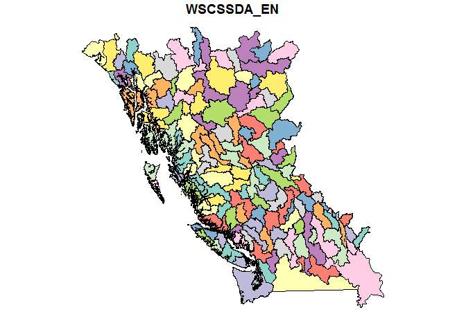
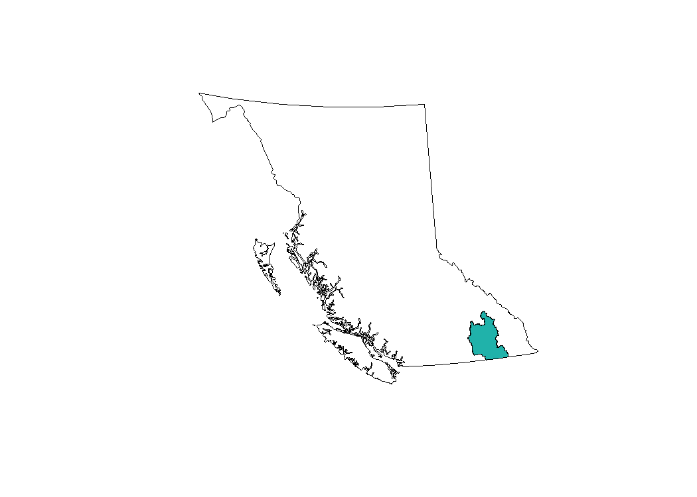
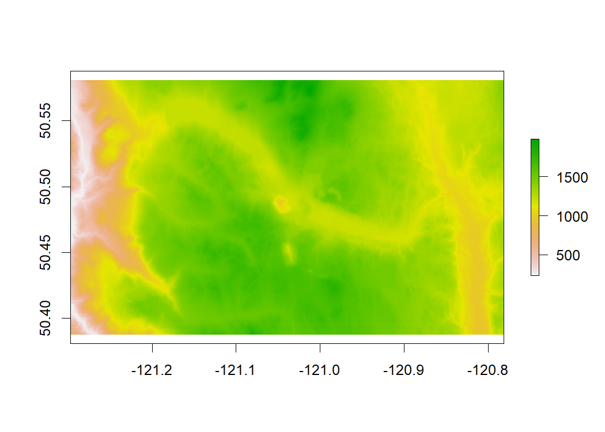
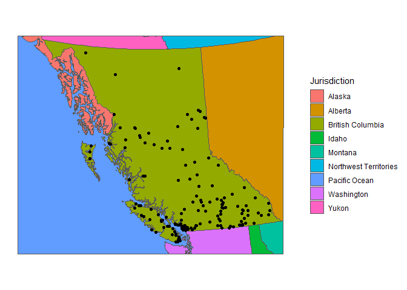
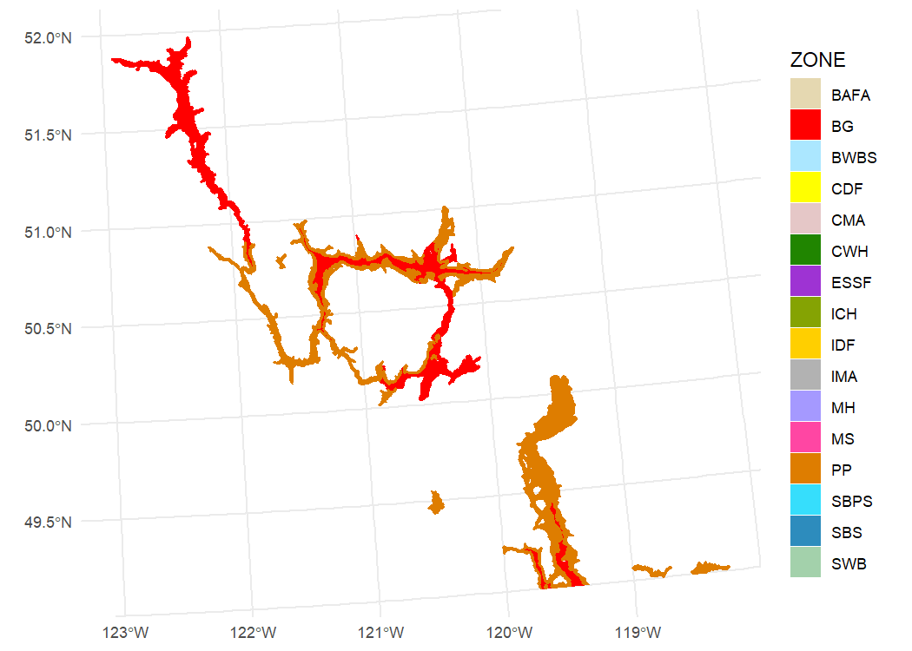

<!-- README.md is generated from README.Rmd. Please edit that file and re-knit-->

# bcmaps 

<!-- badges: start -->

[](https://github.com/bcgov/repomountie/blob/8b2ebdc9756819625a56f7a426c29f99b777ab1d/doc/state-badges.md)
[](https://opensource.org/licenses/Apache-2.0)
[](https://github.com/bcgov/bcmaps/actions)
[](https://cran.r-project.org/package=bcmaps)
[](https://CRAN.R-project.org/package=bcmaps)
<!-- badges: end -->

## Overview

An [R](https://www.r-project.org) package of spatial map layers for
British Columbia.

## Features

Provides access to various spatial layers of British Columbia, such as
administrative boundaries, natural resource management boundaries,
watercourses etc. All layers are available in the [BC
Albers](https://spatialreference.org/ref/epsg/nad83-bc-albers/)
projection, which is the B.C. Government standard as `sf` or `Spatial`
objects.

Most layers are assessed directly from the [B.C. Data
Catalogue](https://catalogue.data.gov.bc.ca/) using the
[bcdata](https://github.com/bcgov/bcdata) R package. See each layers
individual help file for more detail.

## Installation

You can install `bcmaps` from CRAN:

``` r
install.packages("bcmaps")
```

To install the development version of the `bcmaps` package, you need to
install the `remotes` package then the `bcmaps` package.

``` r
install.packages("remotes")
remotes::install_github("bcgov/bcmaps")
```

## Usage

To see the layers that are available, run the `available_layers()`
function:

``` r
library(bcmaps)
available_layers()
```

Most layers are accessible by a shortcut function by the same name as
the object. Then you can use the data as you would any `sf` or `Spatial`
object. The first time you run try to access a layer, you will be
prompted for permission to download that layer to your hard drive.
Subsequently that layer is available locally for easy future access. For
example:

``` r
library(sf)

bc <- bc_bound()
plot(st_geometry(bc))
```

<!-- -->

### Simple Features objects

By default, all layers are returned as [`sf` spatial
objects](https://cran.r-project.org/package=sf):

``` r
library(bcmaps)
library(sf)

# Load and plot the boundaries of B.C.

bc <- bc_bound()
plot(st_geometry(bc))

## Next load the Regional Districts data, then extract and plot the Kootenays
rd <- regional_districts()
kootenays <- rd[rd$ADMIN_AREA_NAME == "Regional District of Central Kootenay", ]
plot(st_geometry(kootenays), col = "lightseagreen", add = TRUE)
```

<!-- -->

### Digital Elevation Model for British Columbia 1:250,000

The `cded_raster` and `cded_stars` functions return the 1:250,000
digital elevation model for British Columbia bounded by some area of
interest. Here we are retrieving the area bounded by the *Logan Lake*
census subdivision:

``` r
library(raster)

aoi <- census_subdivision()[census_subdivision()$CENSUS_SUBDIVISION_NAME == "Logan Lake", ]
aoi_raster <- cded_raster(aoi)
plot(aoi_raster)
```

<!-- -->

### It’s a beautiful day in the neighbourhood

A handy layer for creating maps for display is the `bc_neighbours`
layer, accessible with the function by the same name. This example also
illustrates using the popular [ggplot2](https://ggplot2.tidyverse.org/)
package to plot maps in R using `geom_sf`:

``` r
library(ggplot2)
ggplot() + 
  geom_sf(data = bc_neighbours(), mapping = aes(fill = name)) + 
  geom_sf(data = bc_cities()) +
  coord_sf(datum = NA) +
  scale_fill_viridis_d(name = "Jurisdiction") +
  theme_minimal()
```

<!-- -->

### Biogeoclimatic Zones

As of version 0.15.0 the B.C. BEC (Biogeoclimatic Ecosystem
Classification) map is available via the `bec()` function, and an
accompanying function `bec_colours()` function to colour it:

``` r
bec <- bec()
library(ggplot2)
bec_sub <- bec[bec$ZONE %in% c("BG", "PP"),]
ggplot() +
  geom_sf(data = bec_sub,
          aes(fill = ZONE, col = ZONE)) +
  scale_fill_manual(values = bec_colors()) +
  scale_colour_manual(values = bec_colours())
```

<!-- -->

### Spatial (sp) objects

If you aren’t using the `sf` package and prefer the old standard
[`sp`](https://cran.r-project.org/package=sp) way of doing things, set
`class = "sp"` in either `get_layer` or the shortcut functions:

``` r
library("sp")
# Load watercourse data and plot with boundaries of B.C.
plot(bc_bound(class = "sp"))
plot(watercourses_15M(class = "sp"), add = TRUE)
```

<!-- -->

### Updating layers

When you first call a layer function bcmaps will remind you when that
layer was last updated in your cache with a message. For a number of
reasons, it might be necessary to get a fresh layer in your bcmaps
cache. The easiest way to update is to use the `force` argument:

``` r
ep <- ecoprovinces(force = TRUE)
```

Another option is to actively manage your cache by deleting the old
layer and calling the function again:

``` r
delete_cache('ecoprovinces')
ep <- ecoprovinces(force = TRUE)
```

### Vignettes

After installing the package you can view vignettes by typing
`browseVignettes("bcmaps")` in your R session.

### Utility Functions

The package also contains a couple of handy utility functions:

1.  `fix_geo_problems()` for fixing invalid topologies in `sf` or
    `Spatial` objects such as orphaned holes and self-intersections
2.  `transform_bc_albers()` for transforming any `sf` or `Spatial`
    object to [BC Albers](https://epsg.io/3005) projection.
3.  `self_union()` Union a `SpatialPolygons*` object with itself to
    remove overlaps, while retaining attributes

## Getting Help or Reporting an Issue

To report bugs/issues/feature requests, please file an
[issue](https://github.com/bcgov/bcmaps/issues/).

## How to Contribute

Pull requests of new B.C. layers are welcome. If you would like to
contribute to the package, please see our
[CONTRIBUTING](https://github.com/bcgov/bcmaps/blob/master/CONTRIBUTING.md)
guidelines.

Please note that this project is released with a [Contributor Code of
Conduct](https://github.com/bcgov/bcmaps/blob/master/CODE_OF_CONDUCT.md).
By participating in this project you agree to abide by its terms.

## Source Data

The source datasets used in this package come from various sources under
open licences, including [DataBC](https://data.gov.bc.ca) ([Open
Government Licence - British
Columbia](https://www2.gov.bc.ca/gov/content?id=A519A56BC2BF44E4A008B33FCF527F61))
and [Statistics Canada](https://www.statcan.gc.ca/start) ([Statistics
Canada Open Licence
Agreement](https://www.statcan.gc.ca/eng/reference/licence)). See the
`data-raw` folder for details on each source dataset.

## Licence

    # Copyright 2017 Province of British Columbia
    # 
    # Licensed under the Apache License, Version 2.0 (the "License");
    # you may not use this file except in compliance with the License.
    # You may obtain a copy of the License at
    # 
    # http://www.apache.org/licenses/LICENSE-2.0
    # 
    # Unless required by applicable law or agreed to in writing, software distributed under the License is distributed on an "AS IS" BASIS,
    # WITHOUT WARRANTIES OR CONDITIONS OF ANY KIND, either express or implied.
    # See the License for the specific language governing permissions and limitations under the License.

This repository is maintained by [Environmental Reporting
BC](https://www2.gov.bc.ca/gov/content?id=FF80E0B985F245CEA62808414D78C41B).
Click [here](https://github.com/bcgov/EnvReportBC) for a complete list
of our repositories on GitHub.
