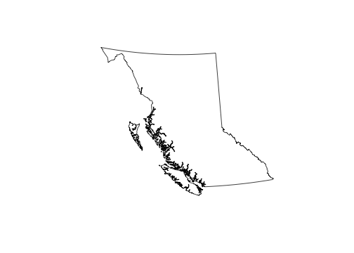
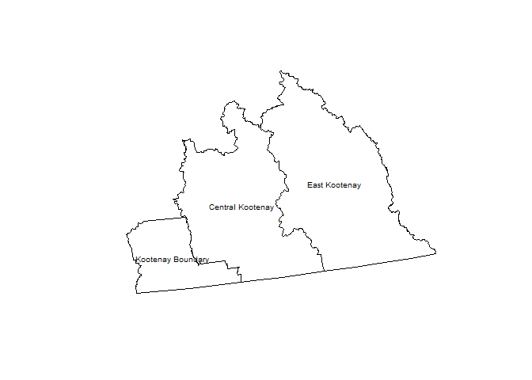
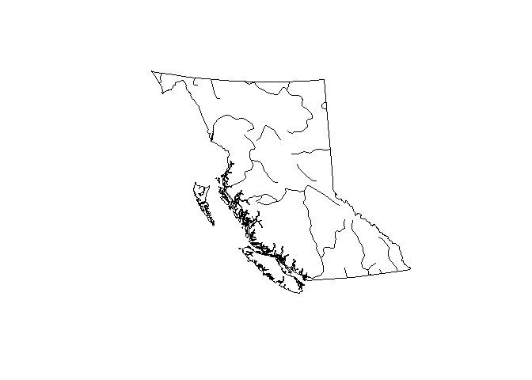

<!-- README.md is generated from README.Rmd. Please edit that file and re-knit-->
<a rel="Delivery" href="https://github.com/BCDevExchange/docs/blob/master/discussion/projectstates.md"></a>

[](https://travis-ci.org/bcgov/bcmaps)

------------------------------------------------------------------------

bcmaps
======

An [R](http://r-project.org) package of map layers for British Columbia.

### Features

Various layers of British Columbia, such as administrative boundaries, natural resource management boundaries, watercourses etc. All layers are available as [sp](http://cran.r-project.org/web/packages/sp/index.html) objects, and are in [BC Albers](http://spatialreference.org/ref/epsg/nad83-bc-albers/) projection, which is the [B.C. government standard](https://www.for.gov.bc.ca/hts/risc/pubs/other/mappro/index.htm).

### Installation

The package is not available on CRAN, but can be installed using the [devtools](https://github.com/hadley/devtools) package:

``` r
install.packages("devtools") # if not already installed

library(devtools)
install_github("bcgov/bcmaps", build_vignettes = TRUE)
```

### Usage

At the moment, there are eleven layers available:

-   `bc_bound`: Coarse provincial boundary of British Columbia (at 1:7.5M scale).

-   `bc_bound_hres`: Detailed provincial boundary, from Statistics Canada.

-   `regional_districts_analysis`: Detailed Regional District boundaries (which are based on Canadian Census boundaries). Suitable for situations where you need detailed boundaries (faithful to the original representation).

-   `regional_districts_disp`: Simplified Regional District boundaries. Much smaller file size than the analysis layer, suitable for situations where you don't need detailed boundaries, often useful when making maps for display.

-   `ecoprovinces`: Boundaries of B.C.'s 10 [ecoprovinces](https://catalogue.data.gov.bc.ca/dataset/51832f47-efdf-4956-837a-45fc2c9032dd)

-   `ecoregions`: Boundaries of B.C.'s 43 [ecoregions](https://catalogue.data.gov.bc.ca/dataset/d00389e0-66da-4895-bd56-39a0dd64aa78)

-   `airzones`: Boundaries of B.C.'s 7 [Air Zones](https://catalogue.data.gov.bc.ca/dataset/e8eeefc4-2826-47bc-8430-85703d328516)

-   `nr_areas`: Boundaries of B.C.'s 3 [Natural Resource (NR) Areas](https://catalogue.data.gov.bc.ca/dataset/c1861ba4-abb8-4947-b3e5-7f7c4d7257d5)

-   `nr_regions`: Boundaries of B.C.'s 8 [Natural Resource (NR) Regions](https://catalogue.data.gov.bc.ca/dataset/dfc492c0-69c5-4c20-a6de-2c9bc999301f)

-   `nr_districts`: [Boundaries of B.C.'s 24 Natural Resource (NR) Districts](https://catalogue.data.gov.bc.ca/dataset/0bc73892-e41f-41d0-8d8e-828c16139337)

-   `watersheds`: [Watershed boundaries delineated for Canada-BC hydrometric stations](https://catalogue.data.gov.bc.ca/dataset/02c0e328-e871-4d05-a672-8faf99ebfc11)

-   `watercourses_15M`: Watercourses for British Columbia at 1:15M scale.

-   `watercourses_5M`: Watercourses for British Columbia at 1:5M scale.

To load any of them, simply type `data(layer_name)`, where `layer_name` is the name of the layer of interest. Then you can use the data as you would any `sp` object.

A couple of simple examples:

``` r
library(bcmaps)
#> Loading required package: sp

# Load and plot the boundaries of B.C.
data(bc_bound)
plot(bc_bound)
```



``` r

## Next load the Regional Districts data, then extract and plot the Kootenays
data(regional_districts_disp)
kootenays <- regional_districts_disp[grep("Kootenay", 
                                          regional_districts_disp$region_name), ]
plot(kootenays)
text(coordinates(kootenays), 
     labels = kootenays$region_name, cex = 0.6)
```



#### Plot watercourses in British Columbia at a course scale

``` r

# Load watercourse data and plot with boundaries of B.C.
data(watercourses_15M)
plot(bc_bound)
plot(watercourses_15M, add = TRUE)
```



#### Size of British Columbia

There is also a simple function that returns the size of B.C. in various units. You can choose total area, land area only, or freshwater area only:

``` r
bc_area("total", "ha")
#> total_ha 
#> 94473500

bc_area("land", "m2")
#>     land_m2 
#> 9.25186e+11

bc_area("freshwater", "km2")
#> freshwater_km2 
#>          19549
```

#### Vignettes

We have written a short vignette on plotting points on one of the layers from `bcmaps`. You can view the vignette online [here](/vignettes/add_points.md) or if you installed the package using `devtools::install_github("bcgov/bcmaps", build_vignettes = TRUE)` you can open it using `browseVignettes("bcmaps")`.

### Project Status

Under active development, we will add different layers iteratively.

### Getting Help or Reporting an Issue

To report bugs/issues/feature requests, please file an [issue](https://github.com/bcgov/bcmaps/issues/).

### How to Contribute

Pull requests of new B.C. layers are welcome. If you would like to contribute to the package, please see our [CONTRIBUTING](CONTRIBUTING.md) guidelines.

Please note that this project is released with a [Contributor Code of Conduct](CODE_OF_CONDUCT.md). By participating in this project you agree to abide by its terms.

### Source data

The source datasets used in this package come from various sources under open licenses, including [DataBC](http://data.gov.bc.ca) ([Open Government License - British Columbia](http://www2.gov.bc.ca/gov/content?id=A519A56BC2BF44E4A008B33FCF527F61)) and [Statistics Canada](http://www.statcan.gc.ca/start-debut-eng.html) ([Statistics Canada Open Licence Agreement](http://www.statcan.gc.ca/eng/reference/licence-eng)). See the `data-raw` folder for details on each source dataset.

### License

The data and code in this repository is licensed under multiple licenses.

-   All R code in the `/R` directory and the `/data-raw` directory is licensed under the [Apache License 2.0](http://www.apache.org/licenses/LICENSE-2.0.html). See LICENSE.Apache-2.0 in the appropriate directories.

-   Source data in `/data-raw/bc_bound` is licensed under the [Open Government License - Canada version 2.0](http://open.canada.ca/en/open-government-licence-canada). See LICENSE.Canada-OGL-2.0 in the appropriate directory.

-   Source data in `/data-raw/census-divisions_statscan` is licensed under the [Statistics Canada Open License Agreement](http://www.statcan.gc.ca/eng/reference/licence-eng). See LICENSE.StatsCan-OLA in the appropriate directory.

-   Source data in `/data-raw/prov_territories_statscan` is licensed under the [Statistics Canada Open License Agreement](http://www.statcan.gc.ca/eng/reference/licence-eng). See LICENSE.StatsCan-OLA in the appropriate directory.

-   Source data in `/data-raw/ecoprovinces` is licensed under the [Open Government License - British Columbia version 2.0](http://www2.gov.bc.ca/gov/content?id=A519A56BC2BF44E4A008B33FCF527F61). See LICENSE.OGL-vbc2.0.pdf in the appropriate directory.

-   Source data in `/data-raw/ecoregions` is licensed under the [Open Government License - British Columbia version 2.0](http://www2.gov.bc.ca/gov/content?id=A519A56BC2BF44E4A008B33FCF527F61). See LICENSE.OGL-vbc2.0.pdf in the appropriate directory.

-   Source data in `/data-raw/airzones` is licensed under the [Open Government License - British Columbia version 2.0](http://www2.gov.bc.ca/gov/content?id=A519A56BC2BF44E4A008B33FCF527F61). See LICENSE.OGL-vbc2.0.pdf in the appropriate directory.

This repository is maintained by [Environmental Reporting BC](http://www2.gov.bc.ca/gov/content?id=FF80E0B985F245CEA62808414D78C41B). Click [here](https://github.com/bcgov/EnvReportBC-RepoList) for a complete list of our repositories on GitHub.
