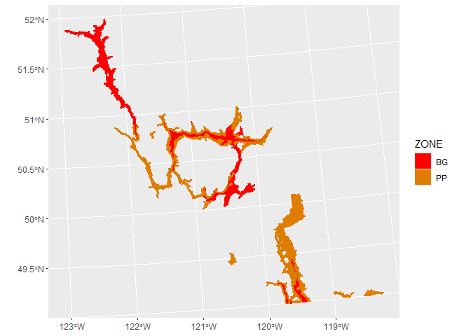

<!-- README.md is generated from README.Rmd. Please edit that file and re-knit-->
bcmaps 
==============================================================================

### Version 0.17.0

<a id="devex-badge" rel="Delivery" href="https://github.com/BCDevExchange/assets/blob/master/README.md"></a> [](https://travis-ci.org/bcgov/bcmaps) [](https://cran.r-project.org/package=bcmaps) [](https://CRAN.R-project.org/package=bcmaps)

Overview
--------

An [R](http://r-project.org) package of spatial map layers for British Columbia.

Features
--------

Provides access to various spatial layers of British Columbia, such as administrative boundaries, natural resource management boundaries, watercourses etc. All layers are available in the [BC Albers](http://spatialreference.org/ref/epsg/nad83-bc-albers/) projection, which is the B.C. Government standard as `sf` or `Spatial` objects.

Layers are stored in the [bcmaps.rdata](https://github.com/bcgov/bcmaps.rdata) package and loaded by this package, following the strategy recommended by [Anderson and Eddelbuettel](https://journal.r-project.org/archive/2017/RJ-2017-026/index.html).

Installation
------------

You can install `bcmaps` from CRAN:

``` r
install.packages("bcmaps")
```

To install the development version of the `bcmaps` package, you need to install the `remotes` package then the `bcmaps` package.

``` r
install.packages("remotes")
remotes::install_github("bcgov/bcmaps")
```

Usage
-----

To get full usage of the package, you will also need to install the [**bcmaps.rdata**](https://github.com/bcgov/bcmaps.rdata) package, which holds all of the datasets.

*Note that unlike most packages it is not necessary to actually load the **bcmaps.rdata** package (i.e., with `library(bcmaps.rdata)`) - in fact it is less likely to cause problems if you don't.*

``` r
install.packages('bcmaps.rdata', repos='https://bcgov.github.io/drat/')
```

To see the layers that are available, run the `available_layers()` function:

``` r
library(bcmaps)
available_layers()
#>            layer_name
#> 1            airzones
#> 2            bc_bound
#> 3       bc_bound_hres
#> 4           bc_cities
#> 5        ecoprovinces
#> 6          ecoregions
#> 7         ecosections
#> 8         gw_aquifers
#> 9          hydrozones
#> 10     municipalities
#> 11           nr_areas
#> 12       nr_districts
#> 13         nr_regions
#> 14 regional_districts
#> 15    water_districts
#> 16    water_precincts
#> 17   watercourses_15M
#> 18    watercourses_5M
#> 19      wsc_drainages
#> 20                bec
#> 21                tsa
#>                                                            title
#> 1                                     British Columbia Air Zones
#> 2                                                    BC Boundary
#> 3                                  BC Boundary - High Resolution
#> 4  BC Major Cities Points 1:2,000,000 (Digital Baseline Mapping)
#> 5                                  British Columbia Ecoprovinces
#> 6                                    British Columbia Ecoregions
#> 7                                   British Columbia Ecosections
#> 8             British Columbia's developed ground water aquifers
#> 9                 Hydrologic Zone Boundaries of British Columbia
#> 10                               British Columbia Municipalities
#> 11                  British Columbia Natural Resource (NR) Areas
#> 12              British Columbia Natural Resource (NR) Districts
#> 13                British Columbia Natural Resource (NR) Regions
#> 14                           British Columbia Regional Districts
#> 15                 British Columbia's Water Management Districts
#> 16                 British Columbia's Water Management Precincts
#> 17                  British Columbia watercourses at 1:15M scale
#> 18                   British Columbia watercourses at 1:5M scale
#> 19                 Water Survey of Canada Sub-Sub-Drainage Areas
#> 20                                      British Columbia BEC Map
#> 21                         B.C. Timber Supply Areas & TSA Blocks
#>    shortcut_function local
#> 1               TRUE  TRUE
#> 2               TRUE  TRUE
#> 3               TRUE  TRUE
#> 4               TRUE  TRUE
#> 5               TRUE  TRUE
#> 6               TRUE  TRUE
#> 7               TRUE  TRUE
#> 8               TRUE  TRUE
#> 9               TRUE  TRUE
#> 10              TRUE  TRUE
#> 11              TRUE  TRUE
#> 12              TRUE  TRUE
#> 13              TRUE  TRUE
#> 14              TRUE  TRUE
#> 15              TRUE  TRUE
#> 16              TRUE  TRUE
#> 17              TRUE  TRUE
#> 18              TRUE  TRUE
#> 19              TRUE  TRUE
#> 20              TRUE FALSE
#> 21              TRUE FALSE
#> 
#> ------------------------
#> Layers with a value of TRUE in the 'shortcut_function' column can be accessed
#> with a function with the same name as the layer (e.g., `bc_bound()`),
#> otherwise it needs to be accessed with the get_layer function.
#> 
#> Layers with a value of FALSE in the 'local' column are not stored in the
#> bcmaps.rdata package but will be downloaded from the internet and cached
#> on your hard drive.
```

Most layers are accessible by a shortcut function by the same name as the object. Then you can use the data as you would any `sf` or `Spatial` object. For example:

``` r
library(sf)
#> Linking to GEOS 3.6.2, GDAL 2.2.3, proj.4 4.9.3

bc <- bc_bound()
plot(st_geometry(bc))
```


Alternatively, you can use the `get_layer` function - simply type `get_layer('layer_name')`, where `'layer_name'` is the name of the layer of interest. The `get_layer` function is useful if the back-end `bcmaps.rdata` package has had a layer added to it, but there is as yet no shortcut function created in `bcmaps`.

``` r
library(sf)
library(dplyr)

ws <- get_layer("wsc_drainages", class = "sf")

plot(ws["SUB_SUB_DRAINAGE_AREA_NAME"], key.pos = NULL)
```


### Simple Features objects

By default, all layers are returned as [`sf` spatial objects](https://cran.r-project.org/package=sf):

``` r
library(bcmaps)
library(sf)

# Load and plot the boundaries of B.C.

bc <- bc_bound()
plot(st_geometry(bc))

## Next load the Regional Districts data, then extract and plot the Kootenays
rd <- regional_districts()
kootenays <- rd[rd$ADMIN_AREA_NAME == "Regional District of Central Kootenay", ]
plot(st_geometry(kootenays), col = "lightseagreen", add = TRUE)
```


### Spatial (sp) objects

If you aren't using the `sf` package and prefer the old standard [`sp`](https://cran.r-project.org/package=sp) way of doing things, set `class = "sp"` in either `get_layer` or the shortcut functions:

``` r
library("sp")
# Load watercourse data and plot with boundaries of B.C.
plot(get_layer("bc_bound", class = "sp"))
plot(watercourses_15M(class = "sp"), add = TRUE)
```


### Biogeoclimatic Zones

As of version 0.15.0 the B.C. BEC (Biogeoclimatic Ecosystem Classification) map is available via the `bec()` function, and an accompanying function `bec_colours()` function to colour it:

``` r
# This example requires the development version of ggplot2 which has the 
# `geom_sf()` function:
# remotes::install_github("tidyverse/ggplot2")
bec <- bec()
library(ggplot2)
ggplot() +
  geom_sf(data = bec[bec$ZONE %in% c("BG", "PP"),],
          aes(fill = ZONE, col = ZONE)) +
  scale_fill_manual(values = bec_colors()) +
  scale_colour_manual(values = bec_colours())
```



### Vignettes

We have written a short vignette on plotting points on one of the layers from `bcmaps`. You can view the vignette online [here](https://cran.r-project.org/web/packages/bcmaps/vignettes/add_points.html) or if you installed the package you can open it using `browseVignettes("bcmaps")`.

### Utility Functions

The package also contains a couple of handy utility functions:

1.  `fix_geo_problems()` for fixing invalid topologies in `sf` or `Spatial` objects such as orphaned holes and self-intersections
2.  `transform_bc_albers()` for transforming any `sf` or `Spatial` object to [BC Albers](https://epsg.io/3005) projection.
3.  `self_union()` Union a `SpatialPolygons*` object with itself to remove overlaps, while retaining attributes

Getting Help or Reporting an Issue
----------------------------------

To report bugs/issues/feature requests, please file an [issue](https://github.com/bcgov/bcmaps/issues/).

How to Contribute
-----------------

Pull requests of new B.C. layers are welcome. If you would like to contribute to the package, please see our [CONTRIBUTING](https://github.com/bcgov/bcmaps/CONTRIBUTING.md) guidelines.

Please note that this project is released with a [Contributor Code of Conduct](https://github.com/bcgov/bcmaps/CODE_OF_CONDUCT.md). By participating in this project you agree to abide by its terms.

Source Data
-----------

The source datasets used in this package come from various sources under open licences, including [DataBC](http://data.gov.bc.ca) ([Open Government Licence - British Columbia](http://www2.gov.bc.ca/gov/content?id=A519A56BC2BF44E4A008B33FCF527F61)) and [Statistics Canada](http://www.statcan.gc.ca/start-debut-eng.html) ([Statistics Canada Open Licence Agreement](http://www.statcan.gc.ca/eng/reference/licence-eng)). See the `data-raw` folder for details on each source dataset.

Licence
-------

    # Copyright 2017 Province of British Columbia
    # 
    # Licensed under the Apache License, Version 2.0 (the "License");
    # you may not use this file except in compliance with the License.
    # You may obtain a copy of the License at
    # 
    # http://www.apache.org/licenses/LICENSE-2.0
    # 
    # Unless required by applicable law or agreed to in writing, software distributed under the License is distributed on an "AS IS" BASIS,
    # WITHOUT WARRANTIES OR CONDITIONS OF ANY KIND, either express or implied.
    # See the License for the specific language governing permissions and limitations under the License.

This repository is maintained by [Environmental Reporting BC](http://www2.gov.bc.ca/gov/content?id=FF80E0B985F245CEA62808414D78C41B). Click [here](https://github.com/bcgov/EnvReportBC-RepoList) for a complete list of our repositories on GitHub.
