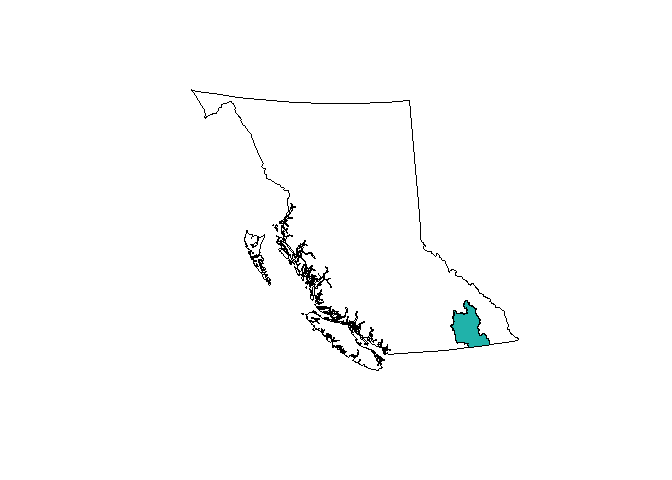

<!-- README.md is generated from README.Rmd. Please edit that file and re-knit-->
bcmaps
======

<a rel="Delivery" href="https://github.com/BCDevExchange/docs/blob/master/discussion/projectstates.md"></a>[](https://travis-ci.org/bcgov/bcmaps)

Overview
--------

An [R](http://r-project.org) package of map layers for British Columbia.

Features
--------

Various layers of British Columbia, such as administrative boundaries, natural resource management boundaries, watercourses etc. All layers are available as [sp](http://cran.r-project.org/web/packages/sp/index.html) objects, and are in [BC Albers](http://spatialreference.org/ref/epsg/nad83-bc-albers/) projection, which is the [B.C. Government standard](https://www.for.gov.bc.ca/hts/risc/pubs/other/mappro/index.htm).

Installation
------------

The package is not available on CRAN, but can be installed from the bcgov R package repository:

``` r
install.packages("drat") # if not already installed
drat::addRepo("bcgov")
install.packages("bcmaps")
```

Usage
-----

To get full usage of the package, you will also need to install the [**bcmaps.rdata**](https://github.com/bcgov/bcmaps.rdata) package, which holds all of the datasets.

``` r
install.packages("bcmaps.rdata")
```

To see the layers that are available, fun the `avialable_layers()` function:

``` r
library(bcmaps)
available_layers()
#>                  Item                                              Title
#> 1            airzones                         British Columbia Air Zones
#> 2            bc_bound                                        BC Boundary
#> 3       bc_bound_hres                      BC Boundary - High Resolution
#> 4        ecoprovinces                      British Columbia Ecoprovinces
#> 5          ecoregions                        British Columbia Ecoregions
#> 6         gw_aquifers British Columbia's developed ground water aquifers
#> 7          hydrozones     Hydrologic Zone Boundaries of British Columbia
#> 8      municipalities                    British Columbia Municipalities
#> 9            nr_areas       British Columbia Natural Resource (NR) Areas
#> 10       nr_districts   British Columbia Natural Resource (NR) Districts
#> 11         nr_regions     British Columbia Natural Resource (NR) Regions
#> 12 regional_districts                British Columbia Regional Districts
#> 13    water_districts     British Columbia's Water Management Districts.
#> 14    water_precincts     British Columbia's Water Management Precincts.
#> 15   watercourses_15M      British Columbia watercourses at 1:15M scale.
#> 16    watercourses_5M       British Columbia watercourses at 1:5M scale.
#> 17         watersheds  British Columbia Hydrometric Watershed Boundaries
#> 18      wsc_drainages      Water Survey of Canada Sub-Sub-Drainage Areas
```

To load any of them, simply type `get_layer('layer_name')`, where `'layer_name'` is the name of the layer of interest. Then you can use the data as you would any `sf` or `Spatial` object:

``` r
library(sf)
#> Linking to GEOS 3.6.2, GDAL 2.2.2, proj.4 4.9.3, lwgeom 2.4.0 r15853
library(dplyr)
#> 
#> Attaching package: 'dplyr'
#> The following objects are masked from 'package:stats':
#> 
#>     filter, lag
#> The following objects are masked from 'package:base':
#> 
#>     intersect, setdiff, setequal, union

ws <- get_layer("watersheds", class = "sf")

plot(ws["SRCNM"], key.pos = NULL)
```


Alternatively, there are shortcut functions for each of the layers:

For example:

``` r
bc <- bc_bound()
plot(st_geometry(bc))
```


Simple Features objects
-----------------------

By default, all layers are returned as [`sf` spatial objects](https://cran.r-project.org/package=sf):

``` r
library(bcmaps)
library(sf)

# Load and plot the boundaries of B.C.

bc <- bc_bound()
plot(st_geometry(bc))

## Next load the Regional Districts data, then extract and plot the Kootenays
rd <- regional_districts()
kootenays <- rd[rd$ADMIN_AREA_NAME == "Regional District of Central Kootenay", ]
plot(st_geometry(kootenays), col = "lightseagreen", add = TRUE)
```



Spatial (sp) objects
--------------------

If you aren't using the `sf` package and prefer the old standard [`sp`](https://cran.r-project.org/package=sp) way of doing things, set `class = "sp"`:

``` r
library("sp")
# Load watercourse data and plot with boundaries of B.C.
plot(bc_bound(class = "sp"))
plot(watercourses_15M(class = "sp"), add = TRUE)
```


### Vignettes

We have written a short vignette on plotting points on one of the layers from `bcmaps`. You can view the vignette online [here](/vignettes/add_points.md) or if you installed the package using `devtools::install_github("bcgov/bcmaps", build_vignettes = TRUE)` you can open it using `browseVignettes("bcmaps")`.

Project Status
--------------

Under active development

Getting Help or Reporting an Issue
----------------------------------

To report bugs/issues/feature requests, please file an [issue](https://github.com/bcgov/bcmaps/issues/).

How to Contribute
-----------------

Pull requests of new B.C. layers are welcome. If you would like to contribute to the package, please see our [CONTRIBUTING](CONTRIBUTING.md) guidelines.

Please note that this project is released with a [Contributor Code of Conduct](CODE_OF_CONDUCT.md). By participating in this project you agree to abide by its terms.

Source Data
-----------

The source datasets used in this package come from various sources under open licences, including [DataBC](http://data.gov.bc.ca) ([Open Government Licence - British Columbia](http://www2.gov.bc.ca/gov/content?id=A519A56BC2BF44E4A008B33FCF527F61)) and [Statistics Canada](http://www.statcan.gc.ca/start-debut-eng.html) ([Statistics Canada Open Licence Agreement](http://www.statcan.gc.ca/eng/reference/licence-eng)). See the `data-raw` folder for details on each source dataset.

Licence
-------

    # Copyright 2017 Province of British Columbia
    # 
    # Licensed under the Apache License, Version 2.0 (the "License");
    # you may not use this file except in compliance with the License.
    # You may obtain a copy of the License at
    # 
    # http://www.apache.org/licenses/LICENSE-2.0
    # 
    # Unless required by applicable law or agreed to in writing, software distributed under the License is distributed on an "AS IS" BASIS,
    # WITHOUT WARRANTIES OR CONDITIONS OF ANY KIND, either express or implied.
    # See the License for the specific language governing permissions and limitations under the License.

This repository is maintained by [Environmental Reporting BC](http://www2.gov.bc.ca/gov/content?id=FF80E0B985F245CEA62808414D78C41B). Click [here](https://github.com/bcgov/EnvReportBC-RepoList) for a complete list of our repositories on GitHub.
