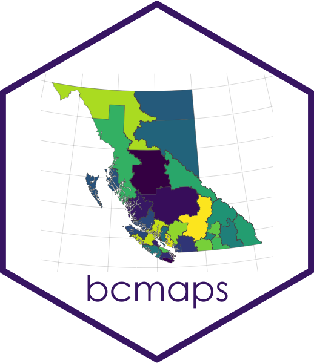

<!-- README.md is generated from README.Rmd. Please edit that file and re-knit-->

# bcmaps 

<!-- badges: start -->

[](https://github.com/bcgov/repomountie/blob/8b2ebdc9756819625a56f7a426c29f99b777ab1d/doc/state-badges.md)
[](https://opensource.org/license/apache-2-0/)
[](https://github.com/bcgov/bcmaps/actions)
[](https://cran.r-project.org/package=bcmaps)
[](https://CRAN.R-project.org/package=bcmaps)
<!-- badges: end -->

An [R](https://www.r-project.org) package of spatial map layers for
British Columbia.

`bcmaps` provides access to various spatial layers of British Columbia,
such as administrative boundaries, natural resource management
boundaries, watercourses, census boundaries, etc. All layers are
available as `sf` objects in the [BC
Albers](https://spatialreference.org/ref/epsg/3005/) projection, which
is the B.C. Government standard.

Most layers are accessed directly from the [B.C. Data
Catalogue](https://catalogue.data.gov.bc.ca/) using the
[bcdata](https://github.com/bcgov/bcdata) R package under the hood. See
each layer’s individual help file for more detail.

> ***IMPORTANT NOTE** Support for Spatial objects (`sp`) was removed in
> {bcmaps} v1.3.0. Please use `sf` objects with {bcmaps}.* A discussion
> on the evolution of the spatial software stack in R can be found here:
> <https://r-spatial.org/r/2022/04/12/evolution.html>.

## Installation

You can install `bcmaps` from CRAN:

``` r
install.packages("bcmaps")
```

To install the development version of the `bcmaps` package, you need to
install the `remotes` package then the `bcmaps` package.

``` r
install.packages("remotes")
remotes::install_github("bcgov/bcmaps")
```

## Quick Start

To see the layers that are available, run the `available_layers()`
function:

``` r
library(bcmaps)
available_layers()
```

Most layers are accessible by a shortcut function by the same name as
the object. Then you can use the data as you would any `sf` object.

``` r
library(sf)

bc <- bc_bound()
plot(st_geometry(bc))
```


## Vignettes

[Getting Started with
`bcmaps`](https://bcgov.github.io/bcmaps/articles/bcmaps.html)  
[Working with `bcmaps` layers and point
data](https://bcgov.github.io/bcmaps/articles/add_points.html)

You can also view vignettes by typing `browseVignettes("bcmaps")` in
your R session after you install `bcmaps`.

## Getting Help or Reporting an Issue

To report bugs/issues/feature requests, please file an
[issue](https://github.com/bcgov/bcmaps/issues/).

## How to Contribute

Pull requests of new B.C. layers are welcome. If you would like to
contribute to the package, please see our
[CONTRIBUTING](https://github.com/bcgov/bcmaps/blob/master/CONTRIBUTING.md)
guidelines.

Please note that this project is released with a [Contributor Code of
Conduct](https://github.com/bcgov/bcmaps/blob/master/CODE_OF_CONDUCT.md).
By participating in this project you agree to abide by its terms.

## Source Data

The source datasets used in this package come from various sources under
open licences, including the [B.C. Data
Catalalogue](https://data.gov.bc.ca) ([Open Government Licence - British
Columbia](https://www2.gov.bc.ca/gov/content?id=A519A56BC2BF44E4A008B33FCF527F61))
and [Statistics Canada](https://www.statcan.gc.ca/start) ([Statistics
Canada Open Licence
Agreement](https://www.statcan.gc.ca/en/reference/licence)). See the
`data-raw` folder for details on each source dataset.

## Licence

    # Copyright 2017 Province of British Columbia
    # 
    # Licensed under the Apache License, Version 2.0 (the "License");
    # you may not use this file except in compliance with the License.
    # You may obtain a copy of the License at
    # 
    # http://www.apache.org/licenses/LICENSE-2.0
    # 
    # Unless required by applicable law or agreed to in writing, software distributed under the License is distributed on an "AS IS" BASIS,
    # WITHOUT WARRANTIES OR CONDITIONS OF ANY KIND, either express or implied.
    # See the License for the specific language governing permissions and limitations under the License.
