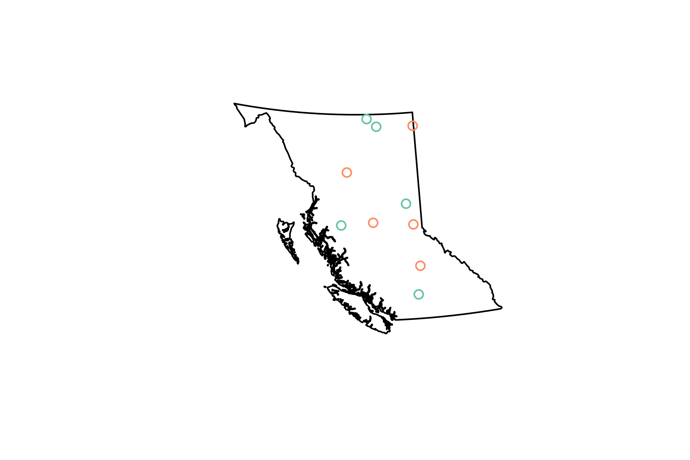

We often want to be able to add point data to a map. This vignette will run through a simple example of converting a `data.frame` of latitude/longitude pairs into a `SpatialPointsDataFrame`, and reprojecting it so that the points can be overlaid on a layer from the `bcmaps` package.

For this example, say we have done surveys for a species across B.C., and we want to be able to add the presences and absences on to a map of British Columbia.

First, load the packages we will need:

- `sf` for working with spatial layers in the *simple features* format
- `bcmaps` for accessing spatial files of B.C.
- `ggplot2` for plotting


```r
library(sf)
library(bcmaps)
```

We will create a mock dataframe of locations of species presence/absences (in real life these would probably be in a csv or Excel file that we would import):


```r
set.seed(42)
spp <- data.frame(site_num = LETTERS[1:10], spp_present = sample(c("yes", "no"), 10, replace = TRUE),
                 lat = runif(10, 49, 60), long = runif(10, -128, -120),
                 stringsAsFactors = FALSE)
head(spp)
#>   site_num spp_present      lat      long
#> 1        A         yes 54.03516 -120.7677
#> 2        B         yes 56.91023 -126.8903
#> 3        C         yes 59.28139 -120.0889
#> 4        D         yes 51.80972 -120.4267
#> 5        E          no 54.08522 -127.3405
#> 6        F          no 59.34016 -123.8863
```

Next we convert this to a `SpatialPointsDataFrame` using the `sp` package. The syntax for doing this is a little obscure - you specify the columns that hold the x and y data in a character vector on the right hand side of the `<-`:


```r
spp <- st_as_sf(spp, coords = c("long", "lat"))
summary(spp)
#>    site_num         spp_present           geometry 
#>  Length:10          Length:10          POINT  :10  
#>  Class :character   Class :character   epsg:NA: 0  
#>  Mode  :character   Mode  :character
plot(spp["spp_present"])
```


In order to overlay these points on other spatial layers, they need to use the same Coordinate Reference System (CRS). Coordinate systems and projections in R can be confusing. There is a great reference on using them here: https://www.nceas.ucsb.edu/sites/default/files/2020-04/OverviewCoordinateReferenceSystems.pdf.

We know that our occurrence data are in decimal degrees in [NAD83](https://epsg.io/4269), so we will assign the corresponding `proj4string`. You can specify the projection using a full proj4 string (`"+proj=longlat +ellps=GRS80 +towgs84=0,0,0,0,0,0,0 +no_defs"`) or the EPSG code (4269). We will use the EPSG code because it's shorter and less likely to make a typo with.


```r
spp <- st_set_crs(spp, 4326)
```

All of the maps in the `bcmaps` package are in BC Albers projection ([EPSG:3005](https://epsg.io/3005)), which is the B.C. government standard. It is an 'equal area' projection, meaning that the size of areas is not distorted, and thus is suitable for analyses on large areas.

If we look at the `proj4string` for `bc_bound` and our `spp_df`, we see that they are different:


```r
bc_bound_data <- bc_bound()
st_crs(bc_bound_data)
#> Coordinate Reference System:
#>   User input: NAD83 / BC Albers 
#>   wkt:
#> PROJCRS["NAD83 / BC Albers",
#>     BASEGEOGCRS["NAD83",
#>         DATUM["North American Datum 1983",
#>             ELLIPSOID["GRS 1980",6378137,298.257222101,
#>                 LENGTHUNIT["metre",1]]],
#>         PRIMEM["Greenwich",0,
#>             ANGLEUNIT["degree",0.0174532925199433]],
#>         ID["EPSG",4269]],
#>     CONVERSION["British Columbia Albers",
#>         METHOD["Albers Equal Area",
#>             ID["EPSG",9822]],
#>         PARAMETER["Latitude of false origin",45,
#>             ANGLEUNIT["degree",0.0174532925199433],
#>             ID["EPSG",8821]],
#>         PARAMETER["Longitude of false origin",-126,
#>             ANGLEUNIT["degree",0.0174532925199433],
#>             ID["EPSG",8822]],
#>         PARAMETER["Latitude of 1st standard parallel",50,
#>             ANGLEUNIT["degree",0.0174532925199433],
#>             ID["EPSG",8823]],
#>         PARAMETER["Latitude of 2nd standard parallel",58.5,
#>             ANGLEUNIT["degree",0.0174532925199433],
#>             ID["EPSG",8824]],
#>         PARAMETER["Easting at false origin",1000000,
#>             LENGTHUNIT["metre",1],
#>             ID["EPSG",8826]],
#>         PARAMETER["Northing at false origin",0,
#>             LENGTHUNIT["metre",1],
#>             ID["EPSG",8827]]],
#>     CS[Cartesian,2],
#>         AXIS["(E)",east,
#>             ORDER[1],
#>             LENGTHUNIT["metre",1]],
#>         AXIS["(N)",north,
#>             ORDER[2],
#>             LENGTHUNIT["metre",1]],
#>     USAGE[
#>         SCOPE["Province-wide spatial data management."],
#>         AREA["Canada - British Columbia."],
#>         BBOX[48.25,-139.04,60.01,-114.08]],
#>     ID["EPSG",3005]]
st_crs(spp)
#> Coordinate Reference System:
#>   User input: EPSG:4326 
#>   wkt:
#> GEOGCRS["WGS 84",
#>     ENSEMBLE["World Geodetic System 1984 ensemble",
#>         MEMBER["World Geodetic System 1984 (Transit)"],
#>         MEMBER["World Geodetic System 1984 (G730)"],
#>         MEMBER["World Geodetic System 1984 (G873)"],
#>         MEMBER["World Geodetic System 1984 (G1150)"],
#>         MEMBER["World Geodetic System 1984 (G1674)"],
#>         MEMBER["World Geodetic System 1984 (G1762)"],
#>         MEMBER["World Geodetic System 1984 (G2139)"],
#>         ELLIPSOID["WGS 84",6378137,298.257223563,
#>             LENGTHUNIT["metre",1]],
#>         ENSEMBLEACCURACY[2.0]],
#>     PRIMEM["Greenwich",0,
#>         ANGLEUNIT["degree",0.0174532925199433]],
#>     CS[ellipsoidal,2],
#>         AXIS["geodetic latitude (Lat)",north,
#>             ORDER[1],
#>             ANGLEUNIT["degree",0.0174532925199433]],
#>         AXIS["geodetic longitude (Lon)",east,
#>             ORDER[2],
#>             ANGLEUNIT["degree",0.0174532925199433]],
#>     USAGE[
#>         SCOPE["Horizontal component of 3D system."],
#>         AREA["World."],
#>         BBOX[-90,-180,90,180]],
#>     ID["EPSG",4326]]
```

So let's transform the dataframe of species presence/absences into the same CRS as `bc_bound`:


```r
spp <- transform_bc_albers(spp)
```

Now we can overlay the points on the provincial boundary dataset:


```r
plot(spp["spp_present"], expandBB = rep(0.2, 4), graticule = TRUE)
```



```r
plot(st_geometry(bc_bound), add = TRUE)
#> Error in UseMethod("st_geometry"): no applicable method for 'st_geometry' applied to an object of class "function"
```

Now we want to know what ecoregion of the province each of these observations
was in. We can use the `ecoregions` data from bcmaps, and the `st_join` function
from the `sf` package to extract ecoregions from the point data and add that information:


```r
ecoreg <- ecoregions(ask = FALSE)
st_join(spp, ecoreg["ECOREGION_NAME"])
#> Simple feature collection with 10 features and 3 fields
#> Geometry type: POINT
#> Dimension:     XY
#> Bounding box:  xmin: 912519.3 ymin: 600149.1 xmax: 1383324 ymax: 1642418
#> Projected CRS: NAD83 / BC Albers
#>    site_num spp_present                   ECOREGION_NAME                 geometry
#> 1         A         yes CENTRAL CANADIAN ROCKY MOUNTAINS  POINT (1341578 1016164)
#> 2         B         yes    BOREAL MOUNTAINS AND PLATEAUS POINT (945861.3 1324757)
#> 3         C         yes                HAY-SLAVE LOWLAND  POINT (1337001 1602713)
#> 4         D         yes               COLUMBIA HIGHLANDS POINT (1383324 770393.7)
#> 5         E          no       EASTERN HAZELTON MOUNTAINS POINT (912519.3 1009950)
#> 6         F          no                   MUSKWA PLATEAU  POINT (1120431 1596971)
#> 7         G          no                   MUSKWA PLATEAU  POINT (1063173 1642418)
#> 8         H          no        THOMPSON-OKANAGAN PLATEAU POINT (1373357 600149.1)
#> 9         I         yes                     FRASER BASIN  POINT (1102484 1025860)
#> 10        J          no CENTRAL CANADIAN ROCKY MOUNTAINS  POINT (1297769 1139361)
```

