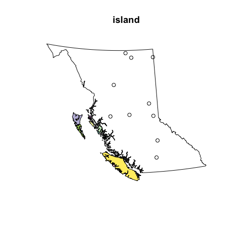

# Adding point data to map layers from bcmaps
`r Sys.Date()`  

We often want to be able to add point data to a map. This vignette will run through a simple example of converting a `data.frame` of latitude/longitutes into a `SpatialPointsDataFrame`, and reprojecting it so that the points can be overlaid on a layer from the `bcmaps` package.

For this example, say we have done surveys for a species across B.C., and we want to be able to add the presences and absences on to a map of British Columbia.

First, load the packages we will need: 

- `sp` for working with Spatial objects, 
- `rgdal` for transforming projections,
- `bcmaps` for accessing spatial files of B.C.
- `ggplot2` for plotting


```r
library(sp)
library(rgdal)
library(bcmaps)
library(ggplot2)
```

We will create a mock dataframe of locations of species presence/absences (in real life these would probably be in a csv or Excel file that we would import):


```r
set.seed(42)
spp <- data.frame(id = 1:10, spp_present = as.logical(rbinom(10,1,0.5)),
                 lat = runif(10, 49, 60), long = runif(10, -128, -120), 
                 stringsAsFactors = FALSE)
head(spp)
```

```
##   id spp_present      lat      long
## 1  1        TRUE 54.03516 -120.7677
## 2  2        TRUE 56.91023 -126.8903
## 3  3       FALSE 59.28139 -120.0889
## 4  4        TRUE 51.80972 -120.4267
## 5  5        TRUE 54.08522 -127.3405
## 6  6        TRUE 59.34016 -123.8863
```

Next we convert this to a `SpatialPointsDataFrame` using the `sp` package. The syntax for doing this is a little obscure - you specify the columns that hold the x and y data in a character vector on the right hand side of the `<-`:


```r
coordinates(spp) <- c("long", "lat")
summary(spp)
```

```
## Object of class SpatialPointsDataFrame
## Coordinates:
##             min        max
## long -127.34050 -120.08887
## lat    50.29236   59.76049
## Is projected: NA 
## proj4string : [NA]
## Number of points: 10
## Data attributes:
##        id        spp_present    
##  Min.   : 1.00   Mode :logical  
##  1st Qu.: 3.25   FALSE:2        
##  Median : 5.50   TRUE :8        
##  Mean   : 5.50   NA's :0        
##  3rd Qu.: 7.75                  
##  Max.   :10.00
```

```r
plot(spp)
```

 

In order to overlay these points on other spatial layers, they need to use the same Coordinate Reference System (CRS). Coordinate systems and projections in R can be confusing. There is a great reference on using them here: https://www.nceas.ucsb.edu/~frazier/RSpatialGuides/OverviewCoordinateReferenceSystems.pdf.

We know that our occurrence data are in decimal degrees in [NAD83](https://epsg.io/4269), so we will assign the corresponding `proj4string`. You can specify the projection using a full proj4 string (`"+proj=longlat +ellps=GRS80 +towgs84=0,0,0,0,0,0,0 +no_defs"`) or the EPSG code (`"+init=epsg:4269"`). We will use the EPSG code because it's shorter and less likely to make a typo with.


```r
proj4string(spp) <- "+init=epsg:4269"
```

All of the maps in the `bcmaps` package are in BC Albers projection ([EPSG:3005](http://epsg.io/3005)), which is the B.C. government standard. It is an 'equal area' projection, meaning that the size of areas is not distorted, and thus is suitable for analyses on large areas.

If we look at the `proj4string` for `bc_bound` and our `spp_df`, we see that they are different:


```r
proj4string(bc_bound)
## [1] "+init=epsg:3005 +proj=aea +lat_1=50 +lat_2=58.5 +lat_0=45 +lon_0=-126 +x_0=1000000 +y_0=0 +datum=NAD83 +units=m +no_defs +ellps=GRS80 +towgs84=0,0,0"
proj4string(spp)
## [1] "+init=epsg:4269 +proj=longlat +datum=NAD83 +no_defs +ellps=GRS80 +towgs84=0,0,0"
```

So let's transform the dataframe of species presence/absences into the same CRS as `bc_bound`:


```r
spp <- spTransform(spp, CRSobj = proj4string(bc_bound))
```

Now we can overlay the points on the provincial boundary dataset:


```r
plot(bc_bound)
points(spp, pch = 21, bg = spp$spp_present)
```

 

We can also quite easily make a similar (and nicer) map using ggplot2:


```r
# Convert the bc_bound SpatialPolygonsDataFrame into a regular data frame for ggplot2 to use
bc_df <- fortify(bc_bound)

# combine the attribute data from spp with the transformed coordinates
spp_df <- cbind(spp@data, coordinates(spp))

ggplot(bc_df, aes(x = long, y = lat, group = group)) + 
  geom_polygon() + 
  geom_point(data = spp_df, 
             aes(x = long, y = lat, group = NULL, colour = spp_present)) + 
  coord_fixed() + 
  theme_minimal() + 
  theme(line = element_blank(), axis.title = element_blank(), axis.text = element_blank())
```

 
