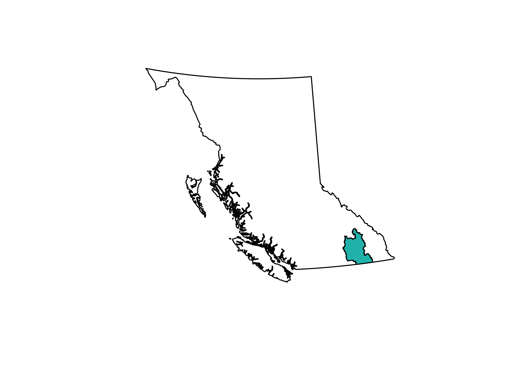
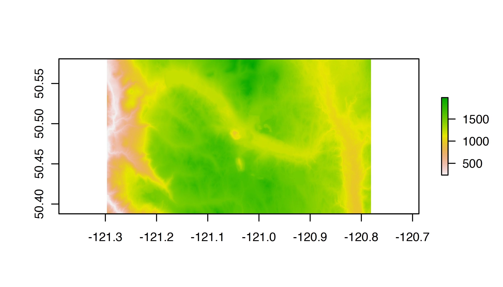
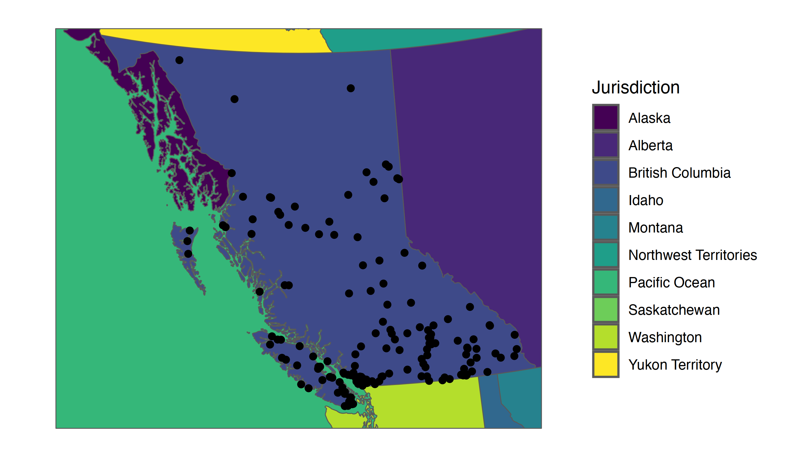
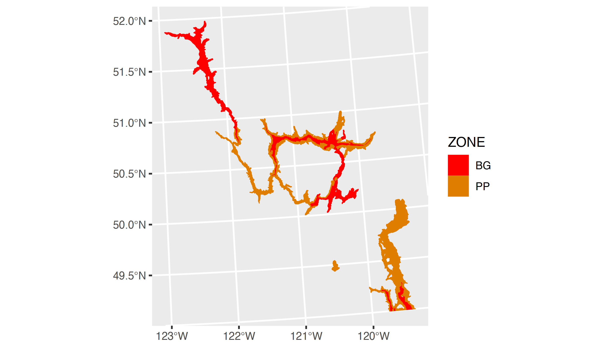

<!--
Copyright 2023 Province of British Columbia

Licensed under the Apache License, Version 2.0 (the "License");
you may not use this file except in compliance with the License.
You may obtain a copy of the License at

http://www.apache.org/licenses/LICENSE-2.0

Unless required by applicable law or agreed to in writing, software distributed under the License is distributed on an "AS IS" BASIS,
WITHOUT WARRANTIES OR CONDITIONS OF ANY KIND, either express or implied.
See the License for the specific language governing permissions and limitations under the License.
-->


## Overview

`bcmaps` is an [R](https://www.r-project.org) package of spatial map layers for British Columbia.


`bcmaps` provides access to various spatial layers of British Columbia, such as
administrative boundaries, natural resource management boundaries, watercourses, census boundaries, etc. All layers are available as `sf` objects in the
[BC Albers](https://spatialreference.org/ref/epsg/nad83-bc-albers/) projection, which is the B.C. Government standard.

Most layers are accessed directly from the [B.C. Data Catalogue](https://catalogue.data.gov.bc.ca/) using the [bcdata](https://github.com/bcgov/bcdata) R package under the hood. See each layer's individual help file for more detail.

> _**IMPORTANT NOTE** Support for Spatial objects (`sp`) was removed in {bcmaps} v1.3.0. Please use `sf` objects with {bcmaps}._ A discussion on the evolution of the spatial software stack in R can be found here: https://r-spatial.org/r/2022/04/12/evolution.html.


## Usage

To see the layers that are available, run the `available_layers()` function:


```r
library(bcmaps)
available_layers()
```

Most layers are accessible by a shortcut function by the same name as the object.
Then you can use the data as you would any `sf` object. The first time
you try to access a layer, you will be prompted for permission to download that layer
to your hard drive. Subsequently that layer is available locally for easy future access. For example:


```r
library(sf)

bc <- bc_bound()
plot(st_geometry(bc))
```


There are two British Columbia boundary map layers available in `bcmaps`:

- `bc_bound()` for fast plotting with suitable detail for most figures (source: [(7.5M) Provinces and States - The Atlas of Canada Base Maps for BC](https://catalogue.data.gov.bc.ca/dataset/b9bd93e1-0226-4351-b943-05c6f80bd5da))
- `bc_bound_hres()` for geospatial analyses requiring detailed lineworks of British Columbia (source: [Province of British Columbia - Boundary Terrestrial](https://catalogue.data.gov.bc.ca/dataset/30aeb5c1-4285-46c8-b60b-15b1a6f4258b))

### Simple Features objects

By default, all layers are returned as [`sf` spatial objects](https://cran.r-project.org/package=sf):


```r
library(bcmaps)
library(sf)

# Load and plot the boundaries of B.C.

bc <- bc_bound()
plot(st_geometry(bc))

## Next load the Regional Districts data, then extract and plot the Kootenays
rd <- regional_districts()
kootenays <- rd[rd$ADMIN_AREA_NAME == "Regional District of Central Kootenay", ]
plot(st_geometry(kootenays), col = "lightseagreen", add = TRUE)
```



### Digital Elevation Model for British Columbia 1:250,000

The `cded_raster` and `cded_stars` functions return the 1:250,000 digital elevation model for British Columbia bounded by some area of interest. Here we are retrieving the area bounded by the _Logan Lake_ census subdivision:


```r
library(raster)

aoi <- census_subdivision()[census_subdivision()$CENSUS_SUBDIVISION_NAME == "Logan Lake", ]
aoi_raster <- cded_raster(aoi)
plot(aoi_raster)
```



### It's a beautiful day in the neighbourhood

A handy layer for creating maps for display is the `bc_neighbours` layer, accessible with the function by the same name. This example also illustrates using the popular [ggplot2](https://ggplot2.tidyverse.org/) package to plot maps in R using `geom_sf` and the `bc_cities()` function available in `bcmaps`:


```r
library(ggplot2)
ggplot() +
  geom_sf(data = bc_neighbours(), mapping = aes(fill = name)) +
  geom_sf(data = bc_cities()) +
  coord_sf(datum = NA) +
  scale_fill_viridis_d(name = "Jurisdiction") +
  theme_minimal()
```




### Biogeoclimatic Zones

As of version 0.15.0 the B.C. BEC (Biogeoclimatic Ecosystem Classification) map
is available via the `bec()` function, and an accompanying function `bec_colours()`
function to colour it:


```r
bec <- bec()
library(ggplot2)
bec_sub <- bec[bec$ZONE %in% c("BG", "PP"),]
ggplot() +
  geom_sf(data = bec_sub,
          aes(fill = ZONE, col = ZONE)) +
  scale_fill_manual(values = bec_colors()) +
  scale_colour_manual(values = bec_colours())
```




### Updating layers

When you first call a layer function `bcmaps` will remind you when that layer was last updated in your cache with a message. For a number of reasons, it might be necessary to get a fresh layer in your `bcmaps` cache. The easiest way to update is to use the `force` argument:


```r
ep <- ecoprovinces(force = TRUE)
```

Another option is to actively manage your cache by deleting the old layer and calling the function again:


```r
show_cached_files()
delete_cache('ecoprovinces')
ep <- ecoprovinces()
```

### Utility Functions

The package also contains a few handy utility functions:

- `transform_bc_albers()` for transforming any `sf` object to
[BC Albers](https://epsg.io/3005) projection
- `bc_area()` to get the total area of British Columbia in various units
- `bc_bbox()` to get an extend/bounding box for British Columbia

